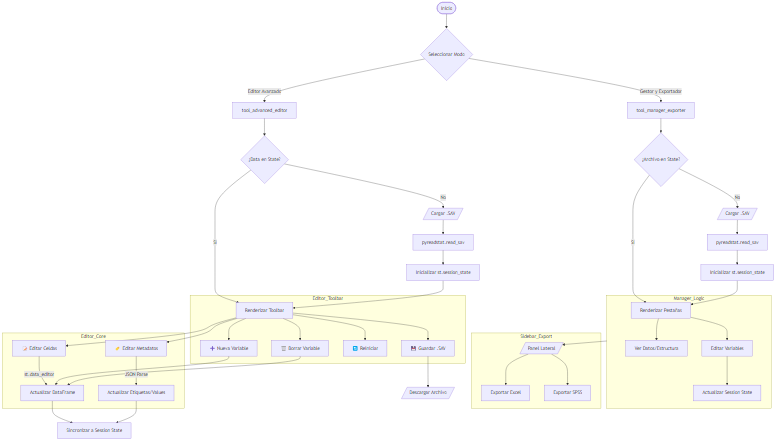

# Documentación Técnica: SPSS Web Tool Manager (`spss_tool.py`)

## Sinopsis
**SPSS Web Tool Manager** es una aplicación web monolítica construida sobre **Streamlit** diseñada para democratizar la manipulación de archivos `.sav` (IBM SPSS). Su propósito es eliminar la barrera de entrada que impone el software propietario de IBM, permitiendo a investigadores y analistas de datos cargar, auditar, editar y exportar datasets complejos directamente desde el navegador. La herramienta opera bajo una arquitectura *stateful*, manteniendo la persistencia de datos y metadatos (etiquetas de variables y valores) en memoria durante la sesión del usuario, ofreciendo dos modos de operación: un **Gestor** para limpieza y exportación rápida, y un **Editor Avanzado** para manipulación granular de datos y metadatos.

---

## Mecánicas
El módulo `spss_tool.py` orquesta la lógica de negocio y la interfaz de usuario en un solo archivo ejecutable. Su funcionamiento se basa en el ciclo de ejecución de Streamlit, donde cada interacción del usuario provoca una re-ejecución del script. Para mitigar la pérdida de contexto entre ejecuciones, el sistema implementa un **Gestor de Estado de Sesión (`st.session_state`)** robusto.

### Arquitectura Lógica (Modelo C4 - Nivel Componente)

1.  **Capa de Entrada (Ingestion Layer)**:
    -   Utiliza `st.file_uploader` para recibir archivos binarios `.sav`.
    -   Los archivos se escriben temporalmente en disco (`temp_input.sav`) para ser procesados por la librería `pyreadstat`, que extrae tanto el `DataFrame` (datos) como el objeto `meta` (metadatos).

2.  **Núcleo de Procesamiento (Processing Core)**:
    -   **Gestión de Estado**: Al cargar un archivo, los datos y metadatos se serializan en `st.session_state`. Esto es crítico para operaciones como "Deshacer" o persistencia al cambiar de pestañas.
    -   **Modo Gestor (`tool_manager_exporter`)**: Enfocado en la *selección* y *filtrado*. Permite seleccionar subconjuntos de columnas y renombrar etiquetas de forma masiva.
    -   **Modo Editor (`tool_advanced_editor`)**: Enfocado en la *mutación*. Utiliza `st.data_editor` para permitir la edición estilo Excel de los datos crudos. Además, incluye un parser JSON para permitir la edición de etiquetas de valor (e.g., cambiar `{1: "Hombre"}` a `{1: "Masculino"}`).

3.  **Capa de Salida (Export Layer)**:
    -   **Re-ensamblaje**: Al exportar a SPSS, el sistema toma el DataFrame modificado y *re-aplica* los metadatos (etiquetas) desde el estado de la sesión.
    -   **Generación de Archivos**:
        -   **Excel**: Usa `openpyxl` para generar reportes, opcionalmente sustituyendo nombres de variables por sus etiquetas.
        -   **SPSS**: Usa `pyreadstat.write_sav` para compilar el binario final.

### Puntos Críticos de Revisión de Código
-   **Gestión de Memoria**: La aplicación carga el dataset completo en RAM. Para archivos masivos (>1GB), esto representa un cuello de botella. *Recomendación*: Implementar carga por *chunks* o usar una base de datos temporal (SQLite) para datasets grandes.
-   **Persistencia Temporal**: El uso de archivos temporales (`temp_input.sav`) puede causar condiciones de carrera en entornos multi-usuario concurrentes si no se manejan sesiones aisladas a nivel de sistema de archivos. Actualmente, Streamlit maneja esto por sesión de navegador, pero el nombre de archivo estático es un riesgo.
-   **Seguridad**: La entrada de JSON en el editor de metadatos se valida con un `try-except` básico. Aunque funcional, la inyección de JSON malformado es un vector de error de usuario común.

---

## Diagramas
El siguiente diagrama de flujo ilustra la lógica de decisión y el flujo de datos dentro de la aplicación.

---

## Contrato de Datos

### Entradas (Inputs)
| Tipo | Formato | Descripción | Restricciones |
| :--- | :--- | :--- | :--- |
| **Archivo Principal** | `.sav` (Binario SPSS) | Archivo de datos propietario de IBM SPSS. | Debe ser un archivo válido parseable por `pyreadstat`. |
| **Interacción Usuario** | JSON (Texto) | Edición de `value_labels` en el Editor Avanzado. | Debe ser un JSON válido, ej: `{"1": "Sí", "0": "No"}`. |
| **Interacción Usuario** | Texto/Numérico | Edición de celdas en `st.data_editor`. | Debe coincidir con el tipo de dato de la columna (int, float, string). |

### Salidas (Outputs)
| Tipo | Formato | Descripción | Origen |
| :--- | :--- | :--- | :--- |
| **Exportación Datos** | `.xlsx` | Archivo Excel con datos crudos. Opción de usar etiquetas como encabezados. | `st.session_state.df` + `modified_labels` |
| **Exportación Nativa** | `.sav` | Archivo SPSS reconstituido con datos y metadatos modificados. | `st.session_state.df` + `meta` |
| **Libro de Códigos** | `.xlsx` | Diccionario de datos con tipos de preguntas, estadísticas y etiquetas. | Metadatos extraídos y calculados. |

---
**Generado por**: Agente Antigravity (Rol: Arquitecto de Software & Documentalista)
**Fecha**: 16 Febrero 2026
